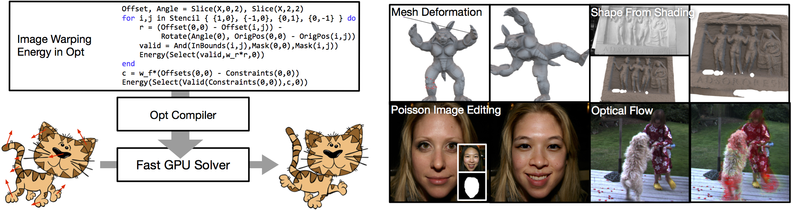
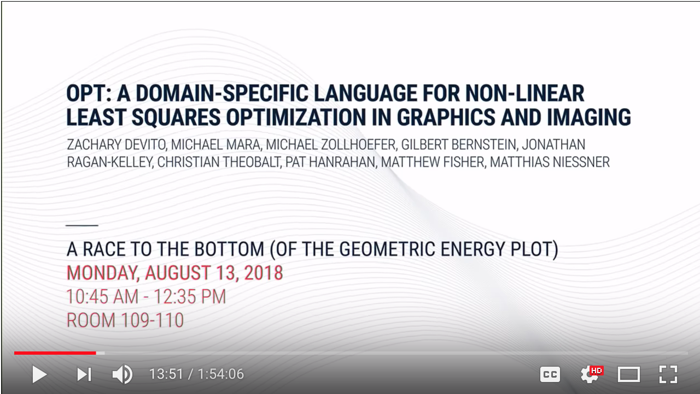
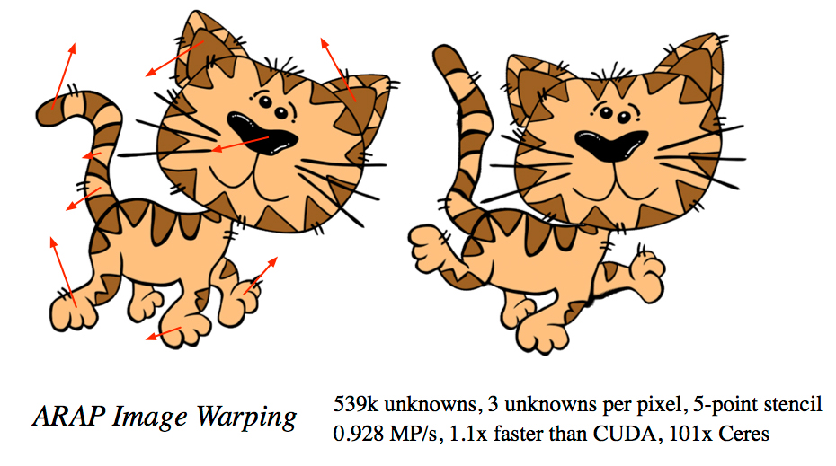
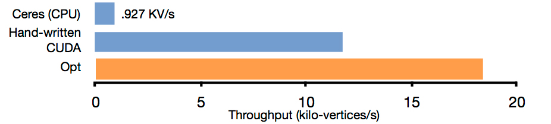
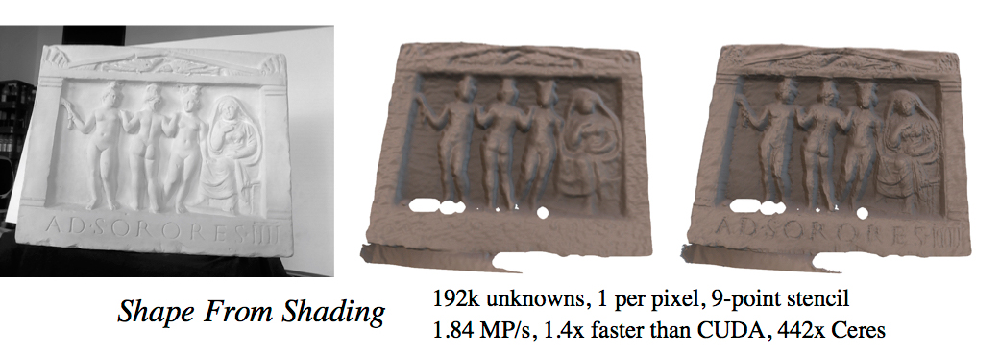
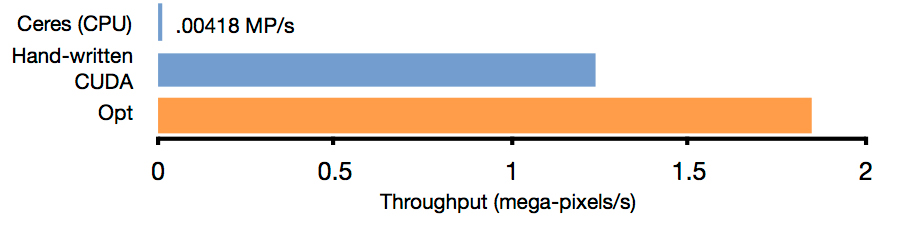
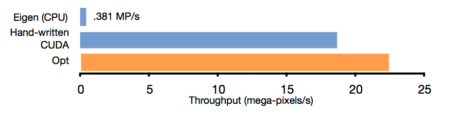
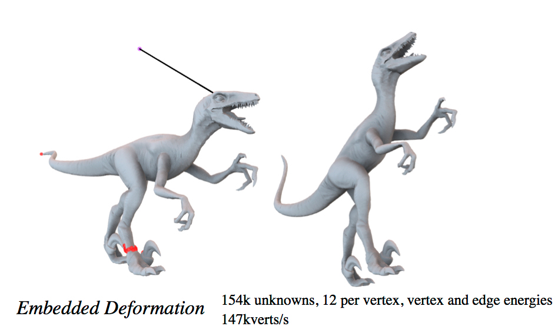
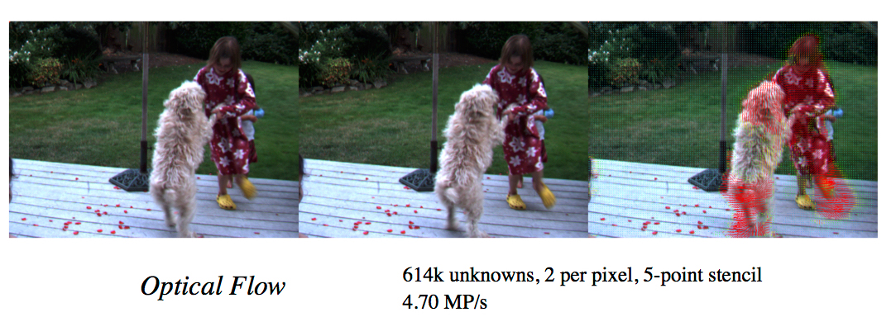

[Zachary DeVito](http://cs.stanford.edu/~zdevito/), [Michael Mara](http://stanford.edu/), [Michael Zollhöfer](http://people.mpi-inf.mpg.de/~mzollhoef/), [Gilbert Bernstein](http://www.gilbertbernstein.com/), [Jonathan Ragan-Kelley](http://people.csail.mit.edu/jrk/), [Christian Theobalt](https://people.mpi-inf.mpg.de/~theobalt/), [Pat Hanrahan](https://graphics.stanford.edu/~hanrahan/), [Matthew Fisher](https://graphics.stanford.edu/~mdfisher/), [Matthias Nießner](http://www.graphics.stanford.edu/~niessner/publications.html)

Many graphics and vision problems are naturally expressed as optimizations with either linear or non-linear least squares objective functions over visual data, such as images and meshes.
The mathematical descriptions of these functions are extremely concise, but their implementation in real code is tedious, especially when optimized for real-time performance in interactive applications.

**Opt** is a new language in which a user simply writes energy functions over image- or graph-structured unknowns, and a compiler automatically generates state-of-the-art GPU optimization kernels.
The end result is a system in which real-world energy functions in graphics and vision applications are expressible in tens of lines of code. They compile directly into highly optimized GPU solver implementations with performance competitive with the best published hand-tuned, application-specific GPU solvers, and 1--2 orders of magnitude beyond a general-purpose auto-generated solver.

Opt was presented at SIGGRAPH 2018. The talk itself was not recorded, but the Fast Forward was:

Slides for the presentation are a good introduction to Opt and are available in:
* [Keynote](Opt_SIGGRAPH2018.key)
* [PDF](Opt_SIGGRAPH2018.pdf)

Please refer to the publication when you are using Opt: [ACM Link](https://dl.acm.org/citation.cfm?id=3132188),[arXiv Link](https://arxiv.org/abs/1604.06525)   ([bibtex](http://www.niessnerlab.org/papers/2017/6opt/devito2017opt.bib))

We have recently released an [early version of the code on Github](https://github.com/niessner/Opt).

For more information, contact:

* mmara at cs dot stanford dot edu
* zdevito at cs dot stanford dot edu
* niessner at cs dot stanford dot edu

or use the github issue tracker.

---

## Example Problems ##

### ARAP Image Warping ###

 

local W,H = Dim("W",0), Dim("H",1)
local Offsets = Unknown("Offsets", float2,{W,H},0) -- u,v,angle
local Angle = Unknown("Angle",float,{W,H},0)
local UrShape = Array("UrShape", float2,{W,H},1) --original mesh position
local Constraints = Array("Constraints", float2,{W,H},2)
local Mask = Array2D("Mask", float, W,H,3) -- validity mask for mesh
local w_fitSqrt = Param("w_fitSqrt", float, 0)
local w_regSqrt = Param("w_regSqrt", float, 1)
--regularization
for x,y in Stencil { {1,0}, {-1,0}, {0,1}, {0, -1} } do
    local e_reg = w_regSqrt*((Offsets(0,0) - Offsets(x,y)) 
                  - Rotate2D(Angle(0,0),(UrShape(0,0) - UrShape(x,y))))
    local valid = eq(Mask(x,y),0)
    Energy(Select(valid,e_reg,0))
end
--fitting
local e_fit = w_fitSqrt*(Offsets(0,0)- Constraints(0,0))
local valid = All(greatereq(Constraints(0,0),0))
Energy(Select(valid, e_fit , 0.0))


---

### ARAP Mesh Deformation ###

 

local N = Dim("N",0)
local Offset = Unknown("X", float6,{N},0) --vertex.xyz, rotation.xyz <- unknown
local Angle = Unknown("Angle",float3, {N},1)
local UrShape = Array("UrShape", float3,{N},2) --original pos: vertex.xyz
local Constraints = Array("Constraints", float3,{N},3) --user constraints
local G = Graph("G", 4, 
                "v0", {N}, 5, 
                "v1", {N}, 6)

UsePreconditioner(true)
local w_fitSqrt = Param("w_fitSqrt", float, 7)
local w_regSqrt = Param("w_regSqrt", float, 8)

--fitting
local e_fit = Offset(0,0) - Constraints(0,0)
local valid = greatereq(Constraints(0,0,0), -999999.9)
Energy(Select(valid,w_fitSqrt*e_fit,0))

--regularization
local ARAPCost = (Offset(G.v0) - Offset(G.v1)) 
                  - Rotate3D(Angle(G.v0),UrShape(G.v0) - UrShape(G.v1))
Energy(w_regSqrt*ARAPCost)



---

### Shape From Shading ###

 

local DEPTH_DISCONTINUITY_THRE = 0.01
local W,H     = Dim("W",0), Dim("H",1)

local X     = Array("X",float, {W,H},0) -- Refined Depth
local D_i     = Array("D_i",float, {W,H},1) -- Depth input

local Im     = Array("Im",float, {W,H},2) -- Target Intensity

local edgeMaskR = Array("edgeMaskR",uint8, {W,H},4) -- Edge mask. 
local edgeMaskC = Array("edgeMaskC",uint8, {W,H},5) -- Edge mask. 

local w_p                        = sqrt(Param("w_p",float,0))-- Fitting weight
local w_s                         = sqrt(Param("w_s",float,1))-- Regularization weight
local w_g                        = sqrt(Param("w_g",float,3))-- Shading weight

local f_x                        = Param("f_x",float,7)
local f_y                        = Param("f_y",float,8)
local u_x                         = Param("u_x",float,9)
local u_y                         = Param("u_y",float,10)
    
local offset = 26;
local L = {}
for i=1,9 do -- lighting model parameters
    L[i] = Param("L_" .. i .. "",float,offset+i)
end

local posX,posY = W:index(),H:index()

-- equation 8
function p(offX,offY) 
    local d = X(offX,offY)
    local i = offX + posX
    local j = offY + posY
    return Vector(((i-u_x)/f_x)*d, ((j-u_y)/f_y)*d, d)
end

-- equation 10
function normalAt(offX, offY)
    local i = offX + posX -- good
    local j = offY + posY -- good
    
    local n_x = X(offX, offY - 1) * (X(offX, offY) - X(offX - 1, offY)) / f_y
    local n_y = X(offX - 1, offY) * (X(offX, offY) - X(offX, offY - 1)) / f_x
    local n_z = (n_x * (u_x - i) / f_x) + (n_y * (u_y - j) / f_y) - (X(offX-1, offY)*X(offX, offY-1) / (f_x*f_y))
    local sqLength = n_x*n_x + n_y*n_y + n_z*n_z
    local inverseMagnitude = Select(greater(sqLength, 0.0), 1.0/sqrt(sqLength), 1.0)
    return inverseMagnitude * Vector(n_x, n_y, n_z)
end

function B(offX, offY)
    local normal = normalAt(offX, offY)
    local n_x = normal[0]
    local n_y = normal[1]
    local n_z = normal[2]

    return           L[1] +
                     L[2]*n_y + L[3]*n_z + L[4]*n_x  +
                     L[5]*n_x*n_y + L[6]*n_y*n_z + L[7]*(-n_x*n_x - n_y*n_y + 2*n_z*n_z) + L[8]*n_z*n_x + L[9]*(n_x*n_x-n_y*n_y)
end

function I(offX, offY)
    return Im(offX,offY)*0.5 + 0.25*(Im(offX-1,offY)+Im(offX,offY-1))
end

local function DepthValid(x,y) return greater(D_i(x,y),0) end
 
local function B_I(x,y)
    local bi = B(x,y) - I(x,y)
    local valid = And(DepthValid(x-1,y),DepthValid(x,y),DepthValid(x,y-1))
    return Select(InBounds(0,0,1)*valid,bi,0)
end
B_I = ComputedArray("B_I",W,H, B_I(0,0))

-- fitting term
local E_p = X(0,0) - D_i(0,0)
Energy(Select(DepthValid(0,0),w_p*E_p,0))

-- shading term
local E_g_h = (B_I(0,0) - B_I(1,0))*edgeMaskR(0,0)
local E_g_v = (B_I(0,0) - B_I(0,1))*edgeMaskC(0,0)
Energy(Select(InBounds(0,0,1,1),w_g*E_g_h,0))
Energy(Select(InBounds(0,0,1,1),w_g*E_g_v,0))

-- regularization term
local function Continuous(x,y) return less(abs(X(0,0) - X(x,y)),DEPTH_DISCONTINUITY_THRE) end
local valid = And(DepthValid(0,0),DepthValid(0,-1),DepthValid(0,1),DepthValid(-1,0),DepthValid(1,0),
                  Continuous(0,-1),Continuous(0,1),Continuous(-1,0),Continuous(1,0),InBounds(0,0,1,1))
valid = eq(ComputedArray(W,H,valid)(0,0),1)
local E_s = 4.0*p(0,0) - (p(-1,0) + p(0,-1) + p(1,0) + p(0,1)) 
Energy(Select(valid,w_s*E_s,0))

-- do not include unknowns for where the depth is invalid
Exclude(Not(DepthValid(0,0)))



---

### Poisson Image Editing ###

 

local W,H = Dim("W",0), Dim("H",1)
local X = Unknown("X", float4,{W,H},0) -- unknown, initialized to base image
local T = Array("T", float4,{W,H},1) -- inserted image
local M = Array("M", float, {W,H},2) -- mask, excludes parts of base image
UsePreconditioner(false)

-- do not include unmasked pixels in the solve
Exclude(Not(eq(M(0,0),0)))

for x,y in Stencil { {1,0},{-1,0},{0,1},{0,-1} } do
    local e = (X(0,0) - X(x,y)) - (T(0,0) - T(x,y))
    Energy(Select(InBounds(1,0),e,0))
end


---

### Cotangent Mesh Smoothing ###

 

local N = Dim("N",0)

local Offset = Unknown("Offset",float3,{N},0)
local RotMatrix = Unknown("RotMatrix",float9,{N},1)

local UrShape =     Array("UrShape", float3,{N},2) -- original position
local Constraints = Array("Constraints", float3,{N},3) -- user constraints
local G = Graph("G", 4, 
                 "v0", {N}, 5, 
                 "v1", {N}, 6)
UsePreconditioner(true)

local w_fitSqrt = Param("w_fitSqrt", float, 7)
local w_regSqrt = Param("w_regSqrt", float, 8)
local w_rotSqrt = Param("w_rotSqrt", float, 9)

--fitting
local e_fit = Offset(0,0) - Constraints(0,0)
local valid = greatereq(Constraints(0,0,0), -999999.9)
Energy(Select(valid, w_fitSqrt*e_fit, 0))

--rot
local R = RotMatrix(0,0)
local c0 = Vector(R(0), R(3), R(6))
local c1 = Vector(R(1), R(4), R(7))
local c2 = Vector(R(2), R(5), R(8))
Energy(w_rotSqrt*Dot(c0,c1))
Energy(w_rotSqrt*Dot(c0,c2))
Energy(w_rotSqrt*Dot(c1,c2))
Energy(w_rotSqrt*(Dot(c0,c0)-1))
Energy(w_rotSqrt*(Dot(c1,c1)-1))
Energy(w_rotSqrt*(Dot(c2,c2)-1))

function Matrix3x3Mul(matrix, v)
    return Vector(
            matrix(0)*v(0)+matrix(1)*v(1)+matrix(2)*v(2),
            matrix(3)*v(0)+matrix(4)*v(1)+matrix(5)*v(2),
            matrix(6)*v(0)+matrix(7)*v(1)+matrix(8)*v(2))
end

local regCost = (Offset(G.v1) - Offset(G.v0)) - 
                Matrix3x3Mul(RotMatrix(G.v0), (UrShape(G.v1) - UrShape(G.v0)))

Energy(w_regSqrt*regCost)

---

### Embedded Deformation ###

 

local N = Dim("N",0)
local X = Array("X", float3,{N},0) -- position
local A = Array("A", float3,{N},1) -- orig position
local G = Graph("G", 0, "v0", {N}, 2, --current vertex
                       "v1", {N}, 3, --neighboring vertex
                       "v2", {N}, 4, --prev neighboring vertex
                       "v3", {N}, 5) --next neighboring vertex

UsePreconditioner(true)

local w_fitSqrt = Param("w_fit", float, 6)
local w_regSqrt = Param("w_reg", float, 7)

function Dot(a,b) return a:dot(b) end

function cot(v0, v1) 
    local adotb = Dot(v0, v1)
    local disc = Dot(v0, v0)*Dot(v1, v1) - adotb*adotb
    disc = Select(greater(disc, 0.0), disc,  0.0001)
    return Dot(v0, v1) / sqrt(disc)
end

function normalize(v)
    return v / sqrt(Dot(v, v))
end

function length(v0, v1) 
    local diff = v0 - v1
    return sqrt(Dot(diff, diff))
end

-- fit energy
Energy(w_fitSqrt*(X(0,0) - A(0,0)))

local a = normalize(X(G.v0) - X(G.v2)) --float3
local b = normalize(X(G.v1) - X(G.v2))    --float3
local c = normalize(X(G.v0) - X(G.v3))    --float3
local d = normalize(X(G.v1) - X(G.v3))    --float3

--cotangent laplacian; Meyer et al. 03
local w = 0.5*(cot(a,b) + cot(c,d))
w = sqrt(Select(greater(w, 0.0), w, 0.0001)) 
Energy(w_regSqrt*w*(X(G.v1) - X(G.v0)))


---

### Optical Flow ###

 

local W,H = Dim("W",0), Dim("H",1)
local X = Array("X", float2,{W,H},0) -- flow vectors
local I = Array("I",float,{W,H},1) -- frame1
local I_hat_im = Array("I_hat",float,{W,H},2) -- frame2, sampled
local I_hat_dx = Array("I_hat_dx",float,{W,H},3) -- partials for frame
local I_hat_dy = Array("I_hat_dy",float,{W,H},4)
 -- create a new math operator that samples from the image
local I_hat = SampledImage(I_hat_im,I_hat_dx,I_hat_dy)

local i,j = W:index(),H:index()
UsePreconditioner(false)
local w_fitSqrt = Param("w_fit", float, 5)
local w_regSqrt = Param("w_reg", float, 6)
-- fitting
local e_fit = w_fitSqrt*(I(0,0) - I_hat(i + X(0,0,0),j + X(0,0,1)))
Energy(e_fit)
-- regularization
for nx,ny in Stencil { {1,0}, {-1,0}, {0,1}, {0,-1} } do
    local e_reg = w_regSqrt*(X(0,0) - X(nx,ny))
    Energy(Select(InBounds(nx,ny),e_reg,0))
end

